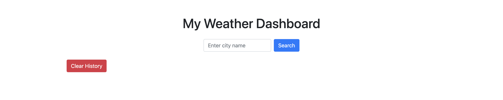
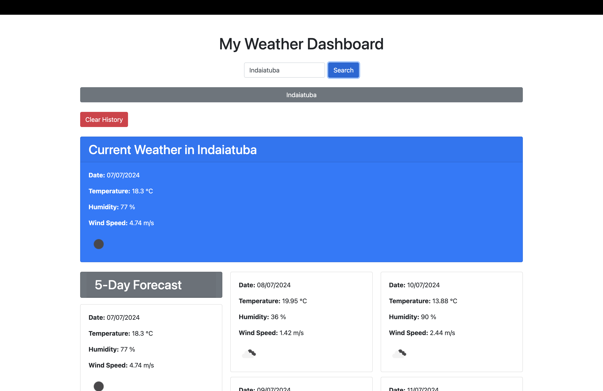
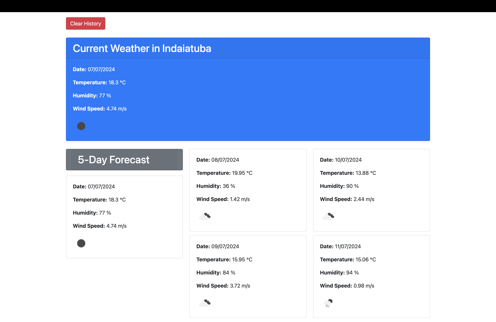
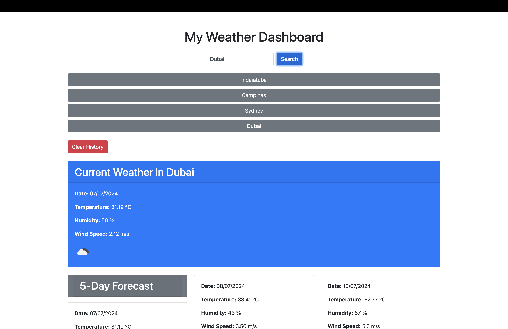

# Weather-Dashboard

It's a a weather dashboard that will run in the browser and feature dynamically updated HTML and CSS.

## Overview

The Weather Dashboard is a web application that allows users to search for current and forecasted weather conditions for multiple cities. The application utilizes the OpenWeatherMap API to retrieve weather data and displays it in a user-friendly format. The app also saves search history in local storage, allowing users to quickly view the weather for previously searched cities.

## Features

- Search for weather by city name.
- View current weather conditions, including temperature, humidity, wind speed, and weather icons.
- View a 5-day weather forecast.
- Save search history to local storage.
- Clear search history with a single click.

## User Story

As a traveler,
I want to see the weather outlook for multiple cities,
So that I can plan a trip accordingly.

## Acceptance Criteria

- Given a weather dashboard with form inputs,
  - When I search for a city,
    - Then I am presented with current and future conditions for that city and that city is added to the search history.
  - When I view current weather conditions for that city,
    - Then I am presented with the city name, the date, an icon representation of weather conditions, the temperature, the humidity, and the wind speed.
  - When I view future weather conditions for that city,
    - Then I am presented with a 5-day forecast that displays the date, an icon representation of weather conditions, the temperature, the wind speed, and the humidity.
  - When I click on a city in the search history,
    - Then I am again presented with current and future conditions for that city.
  - When I click the "Clear History" button,
    - Then the search history is cleared.

## Installation

1. Clone the repository to your local machine:
   ```sh
   git clone https://github.com/yourusername/weather-dashboard.git
   ```
2. Navigate to the project directory:
   ```sh
   cd weather-dashboard
   ```
3. Open `index.html` in your preferred web browser.

## Usage

1. Enter a city name into the search input field and click the "Search" button.
2. View the current weather conditions and 5-day forecast for the city.
3. Click on a city in the search history to quickly view its weather conditions again.
4. Click the "Clear History" button to remove all cities from the search history.

## Screenshots

Below are screenshots of the Weather Dashboard in use:

Homepage + Search City


Search City + Clear History


Current Weather + 5 Days Forecast


List/History of Cities > Local Storage


## API Usage

The application uses the [OpenWeatherMap API](https://openweathermap.org/api) to retrieve weather data.

### Getting an API Key

1. Sign up for an account at [OpenWeatherMap](https://home.openweathermap.org/users/sign_up).
2. Log in to your OpenWeatherMap account.
3. Navigate to the [API keys page](https://home.openweathermap.org/api_keys).
4. Copy your API key.

### Adding the API Key to the Application

1. Open `script.js` in a text editor.
2. Replace `YOUR_API_KEY_HERE` with your actual API key:
   ```javascript
   const apiKey = "YOUR_API_KEY_HERE";
   ```

## Technologies Used

- HTML
- CSS (Bootstrap for styling)
- JavaScript

## Contributing

If you would like to contribute to this project, please follow these steps:

1. Fork the repository.
2. Create a new branch:
   ```sh
   git checkout -b feature/YourFeature
   ```
3. Make your changes.
4. Commit your changes:
   ```sh
   git commit -m 'Add YourFeature'
   ```
5. Push to the branch:
   ```sh
   git push origin feature/YourFeature
   ```
6. Open a pull request.

## Other ways to contribute and questions

Contributions are welcome!
If you want to contribute or have any questions, here are my channels:
gitHub: https://github.com/Alex-Design-For-Reap

email: s.alexsilva@gmail.com

Author: Alex Da Silva https://github.com/Alex-Design-For-Reap/MVC-Blog-Post

## Acknowledgements

- [OpenWeatherMap](https://openweathermap.org/) for providing the weather data API.
- [Bootstrap](https://getbootstrap.com/) for the responsive design framework.
